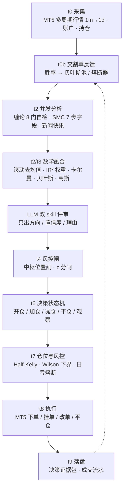

# GoldAgent

面向 XAUUSDm 的自主交易智能体（Python 3.12 + MetaTrader5）。

---

## 一、框架图



模块划分（`src/gold_agent/`）：

| 模块 | 职责 |
|---|---|
| `mt5/` | 终端适配、执行、自检 |
| `skills/` | 缠论、SMC 适配器 |
| `fusion/` | 数学融合、权重、贝叶斯、交割单反馈 |
| `llm/` | 评审编排、客户端 |
| `decision/` | 决策状态机 |
| `risk/` | 仓位、结构、中枢、风控闸 |
| `quant/` | 离线统计工具链 |
| `news/` | 快讯采集 |
| `agent/` | 主图编排（`graph.py`） |
| `common/` | 配置、日志、中文文案 |

---

## 二、使用方法

### 1. 准备

- Python 3.12+
- MetaTrader5 终端已启动并登录
- 复制 `.env.example` 为 `.env`，填入真实值（`.env` 已被 `.gitignore` 忽略，绝不入库）

`.env` 关键项：

```ini
RUNNINGHUB_API_KEY=sk-xxxx      # LLM 与新闻模型密钥
MT5_TERMINAL_PATH=D:\MT5\terminal64.exe
MT5_SYMBOL=XAUUSDm
TRADE_MODE=live                 # dry_run 不真实下单；live 真实下单
MAX_LOT=0.01
```

策略参数集中在 `config.toml`（decision / fusion / llm / risk 四组）。

### 2. 运行

```powershell
py main.py                 # 按 .env 的 TRADE_MODE 运行
py main.py --dry           # 演练模式，不真实下单
py main.py --rounds 10     # 跑 10 轮后退出（默认无限）
```

### 3. 日志

| 文件 | 内容 |
|---|---|
| `logs/decision_YYYYMMDD.jsonl` | 每轮证据包：信号分解、权重表、决策、LLM 评审 |
| `logs/trades.jsonl` | 风控裁定与实际成交 |
| `logs/llm_YYYYMMDD.jsonl` | LLM 交互明细 |
| `logs/news_YYYYMMDD.jsonl` | 快讯与情绪 |

### 4. 测试

```powershell
python -m pytest tests/ -q --no-header -p no:cacheprovider
```

---

## 三、免责声明

**1. 真实资金风险。**
`TRADE_MODE=live` 时程序会对 MT5 账户**真实下单**，可能造成本金损失。请在模拟账户上充分验证后再考虑实盘，并自行承担全部后果。

**2. 当前运行于模拟账户。**
本项目现运行在模拟账户（Exness-MT5Trial5）上，未经过实盘验证。

**3. 盈利能力尚未被证实。**
经 triple barrier + 非重叠校正复核，现有信号源的**方向预测技能无法被证实**；权重实际退化为等权先验；参数在现有数据长度下不可辨识。**本系统不保证盈利，也可能持续亏损。**

**4. 未获得任何认证，也不声明合规。**
项目未取得 SOC 2、ISO 27001 等任何认证。仓库中的合规研究仅为指导自身代码与流程，**不构成资质声明**。

**5. 不构成投资建议。**
本项目仅为技术研究与工程实践产物，不提供任何投资建议、收益承诺或信号服务。

**6. 按现状提供。**
软件以现状（AS IS）提供，无任何明示或暗示担保。使用前请自行审计代码，尤其是风控与下单路径。
