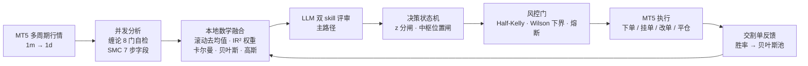

# GoldAgent

**面向 XAUUSDm 的自主交易智能体 · 统计验证驱动 · 可审计**

> ⚠️ live 模式会对 MT5 账户**真实下单**。市场风险自负。本项目当前运行于**模拟账户**（Exness-MT5Trial5）。

---

## 一句话定位

GoldAgent 不是一个"信号发生器"，而是一套**带统计纪律的决策流水线**：
每个信号源必须拿出可复现的预测技能证据才能获得权重，每个参数变更必须附
过拟合检验数字，每个能力边界都如实落进日志。



---

## 一、工程规模

| 维度 | 实测 |
|---|---|
| 生产代码 | **10,011 行 / 40 个模块**（`src/gold_agent/`） |
| 测试 | **5,383 行 / 272 项全部通过**（`pytest tests/`） |
| 设计文档 | **5,350 行 / 17 篇**（`docs/`，含 3,338 行合规研究） |
| 研究脚本 | **6,661 行 / 23 个**（`research/`，全部可复现产出） |
| 集中式配置 | **71 个可调参数**（`config.toml`，四组：decision / fusion / llm / risk） |
| 实盘运行 | **12 个交易日 · 8,985 个决策轮** |

模块划分：`mt5`（终端适配/执行）、`skills`（缠论 + SMC）、`fusion`（数学融合）、
`llm`（评审编排）、`decision`（状态机）、`risk`（仓位/结构/风控）、`quant`
（离线统计工具链）、`agent`（主图编排）、`news`（快讯）。

---

## 二、核心机制与证据

每项机制都标注了代码位置与其**实测依据**——没有实测依据的能力不做宣称。

| 机制 | 实现 | 依据 |
|---|---|---|
| **IR² 加权融合** | `fusion/weights.py` | 权重取自 68,871 根 bar 的离线校准（`data/source_ir.json`） |
| **DerSimonian-Laird 收缩** | `fusion/weights.py:248-262` | `w = λ·w_measured + (1−λ)·w_prior`；λ 由 τ² 自适应 |
| **滚动 z-score 去均值** | `fusion/normalize.py` | 消除结构性方向偏置（黄金长期上行的多头漂移） |
| **卡尔曼趋势** | `fusion/kalman.py` | 匀速模型 `F=[[1,1],[0,1]]`，R 自适应于平均波幅 |
| **贝叶斯命中率池** | `fusion/bayes.py` | Beta(1,1) 后验 + logit 证据，负证据钳制 |
| **Wilson 置信下界** | `risk/position.py:182` | 3 笔 1 胜 → 下界 **0.0615**（点估计 0.3333）→ 自动缩仓 |
| **Half-Kelly 仓位** | `risk/position.py:175` | `f* = (p·b−q)/b`，再折 10% 保守上限 |
| **缠论 8 门严格自检** | `skills/chanlun_adapter.py` | 未过门信号降为 `observe`，**不计分** |
| **SMC 7 步字段采集** | `skills/mobius_adapter.py` | CHoCH 优先级高于 BOS，近端加权 ×1.0/×0.7/×0.5 |
| **中枢位置闸** | `risk/zhongshu.py` | 价格处于中枢中部 30% 区间 → 禁止开仓 |
| **0.5–0.618 回调带** | `risk/structure.py` | 实测挂单成交率 2m **79.6%→86.7%**、15m **73.8%→86.2%** |
| **单实例锁** | `runner.py:369` | `O_CREAT\|O_EXCL` + pid 存活检测，残留锁自动接管 |

---

## 三、验证纪律（本项目的核心差异）

零售自动化交易领域最常见的问题是**把噪声当 alpha**。本项目把这件事当成一等公民，
并付了实现成本：

### 3.1 过拟合检验三件套（对齐 SR 26-2 / DSR / PBO / MinBTL）

`quant/labeling.py` + `research/22_param_gate.py` 实现了完整的参数门：

- **Purged K-Fold CV + Embargo** —— 训练集选阈值、测试集评估，切断标签重叠泄漏
- **Deflated Sharpe Ratio** —— 惩罚多次试验（试验族规模 N 显式记录在 `data/trials.csv`）
- **PBO / CSCV** —— 样本内最优配置在样本外跑输中位数的概率
- **MinBTL** —— 纯噪声下 N 次试验的期望最大 Sharpe

> **纪律：任何参数变更必须附 DSR 数字。没有 = 回滚。**

### 3.2 三重独立对照

判断一个信号是否真有技能，本项目不满足于单一显著性检验：

| 对照设计 | 作用 |
|---|---|
| 随机方向 ×200 | 基准分布 |
| **匹配多头比例**的随机方向 ×40 | 排除"结构性做多"伪装成 alpha |
| **块置换自身方向序列** ×100（保留自相关） | 排除自相关造成的虚高显著性 |

### 3.3 重叠校正（最重要的方法论发现）

同一信号在相邻 bar 上重复出现，会把**同一笔独立判断**计成上百笔"交易"。

> 实测：缠论信号在 15 根 1m 上重复 → 46,559 笔"交易"实际只对应 **261 个独立决策**
> （重叠 **178 倍**）。不校正时毛 NW-t = **+3.32**（看似强 alpha），
> 校正后塌到 **−0.20**。

**凡是"毛收益"数字，必须先做非重叠校正。**

### 3.4 可失败断言

测试本身也要能被证伪。项目记录并修掉了两处"永不失败"的测试：

- 旧断言 `assert ic > -0.05`，而实测 IC = −0.04 —— **该测试在过去所有运行里都不可能失败**
- 曾用一条测试把"没有任何源通过验证 → 权重全 0 → 不开仓"断言成**正确的预期行为**，
  即把 bug 固化成预期。**一个不交易的交易系统是失败状态，不是安全状态。**

---

## 四、工程健壮性

长期常驻、真金白银运行的系统，故障模式比功能更重要。

| 类别 | 机制 |
|---|---|
| **资金安全** | 单实例锁（拒绝并发下单同一账户）；下单/改单幂等键；`TRADE_ACTION_SLTP` 整体覆盖语义保护 |
| **风控硬闸** | 当日亏损 ≥3% 停新仓；回撤 ≥8% 降杠杆、≥12% 全停；保证金 >60% 拒单；近 100 笔同向 >85% **停机复查** |
| **降级路径** | 任何 LLM 请求都有超时与重试上限，失败即降级不阻塞；信号源异常 → 权重 0 而非崩溃 |
| **启动预热** | 归一化器需 240 轮预热（1m 下 = 4 小时），否则所有源恒为 0 → 永不开仓。`prime_history()` 启动回放 300 轮（约 7 秒） |
| **编码安全** | 控制台 GBK 环境：全部日志纯中文、无装饰性符号；`_safe_print()` 三级兜底 |
| **日志完整性** | `logging_util.jlog` **默认拒绝**非实盘进程写生产日志目录，需显式 `set_live()` |
| **状态对账** | 崩溃重启后先用 MT5 实际持仓对账（magic 过滤）再恢复内部状态 |
| **配置纪律** | 71 个参数集中化；禁止"声明了但无人读取"的死配置 |

---

## 五、合规研究资产

`docs/compliance/`（**3,338 行 / 7 篇**）是对 1–3 人小团队销售 EA/信号产品所面临监管环境的
一手调研，**全部附 URL、标注核验状态**（`[UNVERIFIED]` 明示）。

覆盖范围：

- **模型风险治理**：SR 26-2（2026-04-17，**取代 SR 11-7**）、PRA SS1/23（五原则）、ECB TRIM
- **策略验证**：DSR、PBO/CSCV、MinBTL、White Reality Check、Hansen SPA、Romano-Wolf
- **销售与牌照**：CFTC/NFA（Rule 2-29、4.41、Staff Letter 26-25）、MiFID II、ESMA 产品干预、FCA COBS 4 / PERG 8.30.5G
- **技术合规**：RTS 6（Art 1–17）、DORA、SEC 15c3-5、CFTC Electronic Trading Risk Principles
- **认证成本**：SOC 2、ISO/IEC 27001:2022、EU AI Act

> **定位说明（诚实）**：本项目**未获得任何认证，也未声明合规**。
> 该文档的结论是"这些银行标准的**合规义务**对小型供应商完全不适用，
> 但其**结构**是可白拿的最佳实践模板"。引用它是为了**指导代码与流程**，
> 不是为了宣称资质。

---

## 六、当前状态（诚实披露）

### 6.1 运行数据

| 指标 | 实测 |
|---|---|
| 账户 | 模拟账户 · 余额 ~100,064 USD |
| 已平仓交易 | **222 笔** |
| 胜率 | **54.95%**（122 胜 / 100 负） |
| 盈亏比 | **1.22**（毛利 990.6 / 毛损 813.4 USD） |
| 决策轮次 | 8,985 轮 / 12 个交易日 |

### 6.2 已证实的能力

- **风险与波动建模有效**：波动率模型与未来 \|收益\| 的秩相关达 **+0.29**，高低分位波动比 **2.16×**
- **工程链路可靠**：真实 MT5 下单、挂单、改单、平仓全通；12 天连续运行
- **风控生效**：`risk_reject` 731 次、`order_rejected` 436 次均被正确拦截

### 6.3 尚未证实 / 已知局限

> 这一节不是免责套话，而是当前系统**真实的证据状态**。

1. **方向预测的边际优势尚未被独立证据确认。**
   用 triple barrier + 非重叠校正复核后，现有信号源的预测技能都无法证实
   （非重叠毛 NW-t 均在 0 附近）。系统会开仓，但**边际优势尚未被独立证据确认**。

2. **权重实际运行在等权先验上。** 三个可测源的实测 skill 均为负
   （−0.17 / −0.40 / −0.46），源间差异**不比纯抽样噪声更大**
   （Q = 0.0455 < df = 2）→ λ = 0 → 权重退化为等权。
   系统因此标记为 `uncalibrated` 并**自动减半手数**。

3. **`openmobius_smc` 权重恒为 0。** 原因是**结构性不可测**（Mobius API 无历史回放），
   不是"不显著"——即使其离线桩得分最高也不给权重。这是事实判断。

4. **参数当前不可辨识。** 阈值调参在 60,000 根真实 1m bar 上做过 DSR + PBO + MinBTL
   检验，**没有一个候选通过**（DSR 全 0、PBO = 1.0、数据长度 0.17 年 < 所需 2.13 年）。
   正确读法是"本门无法区分候选优劣"，而非"某个值更好"。**没有 DSR 支撑的调参只会增大试验族。**

5. **系统择时与随机入场在统计上无法区分。** 配对零假设检验：真实入场落在区间中间
   60% 的比例 **56.6%**，随机时刻对照 **57.1%**（差 −0.5pp，不显著）。

6. **1m 周期的成本结构极紧。** 往返成本 0.52 USD；1m 上盈亏平衡所需 IC **> 0.50**，
   而现实模型 IC 约 0.02~0.05。**周期的选择比模型调参重要一个数量级。**

> **下一步的正确方向**：不是继续调阈值，而是寻找**有真实 IC 的新信息源**，
> 并把已验证的波动率模型用在它真正擅长的地方（仓位管理与风险控制）。

---

## 七、快速开始

```powershell
# 依赖：Python 3.12+、MetaTrader5 终端已运行
py main.py                 # 实盘/模拟（取决于 .env 的 TRADE_MODE）
py main.py --dry           # 演练，不下单
py main.py --rounds 10     # 限 10 轮
```

密钥放 `.env`（`TRADE_MODE`、`MAX_LOT`、LLM/新闻 token）；策略参数在 `config.toml`。

### 日志

| 文件 | 内容 |
|---|---|
| `logs/decision_YYYYMMDD.jsonl` | 每轮完整证据包：信号分解、权重表、决策、LLM 评审 |
| `logs/trades.jsonl` | 风控裁定与实际成交 |
| `logs/llm_YYYYMMDD.jsonl` | LLM 交互明细 |
| `logs/news_YYYYMMDD.jsonl` | 快讯与情绪 |

### 复现验证

```powershell
$py = "C:\Users\admin\AppData\Local\Programs\Python\Python312\python.exe"

& $py -m pytest tests/ -q --no-header -p no:cacheprovider   # 272 项测试
& $py research/21_source_ir.py --bars 60000 --write         # 信号源 IR 校准
& $py research/22_param_gate.py                             # 参数门（DSR + PBO + MinBTL）
& $py research/23_kalman_tb.py                              # 止损宽度实测
```

---

## 八、文档索引

| 文件 | 内容 |
|---|---|
| `docs/00-architecture.md` | 总体架构、主循环、模块契约 |
| `docs/01-mt5-adapter.md` | MT5 终端适配与订单语义 |
| `docs/02-skills-integration.md` | 8 门自检、7 步字段、降级矩阵 |
| `docs/03-llm-orchestration.md` | LLM 主路径与预算分离 |
| `docs/04-signals-fusion.md` | 卡尔曼/贝叶斯/高斯融合、去均值、IR 权重 |
| `docs/05-position-risk.md` | 仓位、Wilson 下界、熔断、参数纪律 |
| `docs/06-decision-machine.md` | 状态机、阈值判定、验收指标 |
| `docs/07-news-integration.md` | 快讯集成 |
| `docs/08-test-plan.md` | 分层测试计划与验收标准 |
| `docs/09-quant-math-augmentation.md` | 数学模型增补的研究结论 |
| `docs/compliance/` | 商用合规标准与调研（SR 26-2 / DSR / PBO / MinBTL 等） |
| `research/` | 可复现研究脚本与结论 |

---

## 九、明确不做的事

1. **不使用模拟/合成数据做测试** —— 全部走真实终端、真实 API、真实历史。
   唯一允许的"模拟"是执行层切到 `dry_run`。
2. **不绕过风控门直接下单** —— 任何手动干预必须留痕。
3. **不让 LLM 决定手数** —— LLM 只输出方向/置信度/理由，仓位只由风控模块计算。
4. **不给未验证的信号源权重** —— 没有实测 IR 的源权重为 0，不做兜底猜测。
5. **不宣称未经验证的能力** —— 更不为展示效果而选择性披露。
