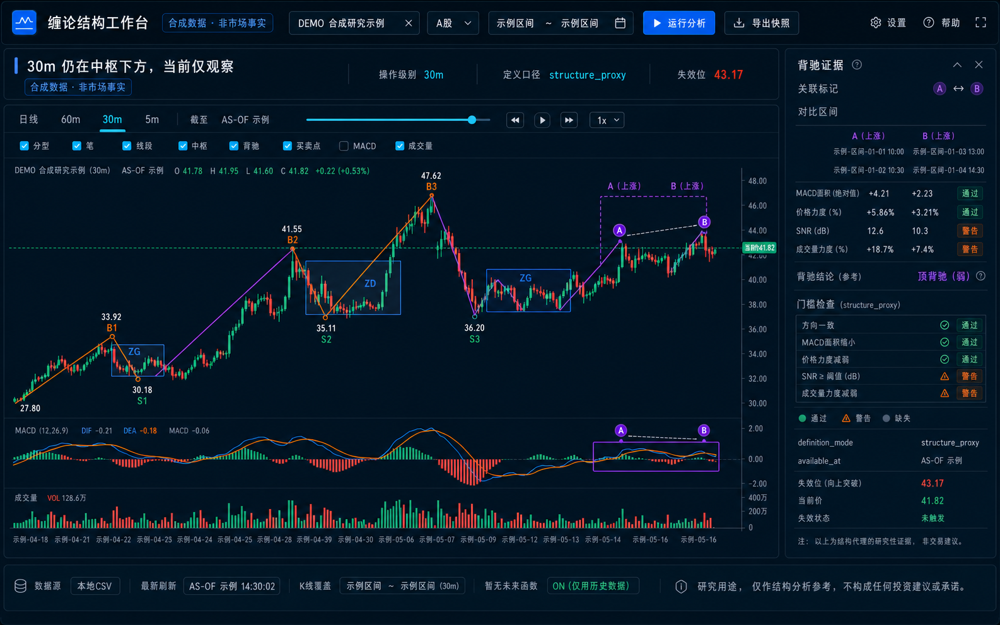

[中文版 / Chinese](./README.md)

# chanlun-trading-system · Chanlun Analysis Skill

> ⚠️ **Disclaimer: for technical research & study only; NOT investment advice; no buy/sell signals; no return guarantee.** Chanlun has subjectivity and failure risk. You are responsible for your own gains and losses.

This project turns the technical analysis system of **Chanlun (缠中说禅 / Chan theory)** into a **Skill** that can be loaded directly into an AI Agent. When an AI helps you review the trend of A-shares, Hong Kong stocks, ETFs, indices, or futures, this Skill forces it to **define the level first, identify the structure first, and write the invalidation point first**, instead of blurting out a "must-rise buy point."

## What This Skill Actually Does

| It is not | It is |
|---|---|
| ❌ A "must-rise signal" machine | ✅ A disciplined analysis workflow |
| ❌ Calling buy whenever an indicator crosses upward | ✅ Requiring the full chain of inclusion → fractal (fenxing / 分型) → stroke/pen (bi / 笔) → segment (xianduan / 线段) → center (zhongshu / 中枢) → divergence (beichi / 背驰) → buy/sell point before drawing a conclusion |
| ❌ Treating every breakout as a 3rd-class buy point | ✅ Recognizing a 3rd-class buy only after the center departure, pullback, and non-return are all explicitly named |
| ❌ Pretending to understand every chart | ✅ Downgrading to "observe" when data is insufficient, while explaining the approximation loss |

The core is an **Audit Gate**: level gate → structure gate → type gate → comparison gate → buy/sell-point gate → trigger gate → risk gate → downgrade gate. If any step is missing, the output is automatically downgraded from "confirmed buy" to "observe."

Chanlun's three classes of trade locations are referred to as **1st/2nd/3rd-class buy/sell points (三类买卖点)**. They are research labels for structural analysis only, not buy/sell signals or investment instructions.

## Installation

### 1. Run the visual workbench

After installing [`uv`](https://docs.astral.sh/uv/getting-started/installation/), run the pinned release without modifying an existing Python environment:

```bash
uvx --from "git+https://github.com/noahnan-max/chanlun-trading-system.git@v0.1.1" chanlun-visual
```

For a persistent installation:

```bash
uv tool install "git+https://github.com/noahnan-max/chanlun-trading-system.git@v0.1.1"
chanlun-visual doctor --json
chanlun-visual
```

These remote commands require the GitHub `v0.1.1` tag to exist. Before it is published, use the local development path below. The public-quote adapter is optional; the bundled demo and CSV workflow do not need it:

```bash
uv tool install --with yfinance "git+https://github.com/noahnan-max/chanlun-trading-system.git@v0.1.1"
```

### 2. Install the AI Skill

Codex/OpenAI users can ask `$skill-installer` to install `chanlun-trading-system` from this repository. Alternatively, download `chanlun-trading-system-skill.zip` from a GitHub Release and run:

```bash
mkdir -p "$HOME/.agents/skills"
unzip chanlun-trading-system-skill.zip -d "$HOME/.agents/skills"
```

Tencent SkillHub uses `chanlun-trading-system-skillhub.zip` from the same Release. It differs only by the distribution metadata required by SkillHub; the rules and helper script remain identical.

The Skill and the visual runtime are separate install units. The Skill supports governed text analysis by itself; interactive charts also require `chanlun-visual`. The Skill checks `doctor` first and never installs software silently.

**Claude Code** can extract the same Skill archive under `~/.claude/skills/`. For a local clone:

```bash
git clone https://github.com/noahnan-max/chanlun-trading-system.git
cp -r chanlun-trading-system ~/.claude/skills/
# Start a new session and ask:
# "Use Chanlun to help me review the daily trend of XXXX"
# The Skill should be triggered automatically.
```

Other agents and local models can load `SKILL.md` as a system prompt and read only the relevant `references/*.md` files.

**Any AI / no coding required**: open **`缠论Skill_完整版_通用AI.md`**. It is the most detailed Chinese general-purpose version, including the scheduling protocol and practical examples, and is suitable for DeepSeek, Doubao, Kimi, Yuanbao, Qwen, ChatGPT, Claude, and other AIs. Copy the whole file into the chat box and start with:

> "Analyze the trend of [symbol] according to this rule set. Define the level first, identify the structure first, write the invalidation point first, and do not give me direct buy/sell advice."

## Visual Research Workbench (v0.1)

The repository also includes a local-first interactive workbench. It annotates OHLCV data with fractals, strokes, a segment proxy, centers, divergence evidence, and candidate structural locations. Every object exposes its confirmation/availability time, definition mode, and approximation loss.



> This is an interaction concept using synthetic data, not a live-market screenshot. [View the mobile concept](./docs/design/chanlun-workbench-mobile-concept.png).

### 3. Local development install

```bash
git clone https://github.com/noahnan-max/chanlun-trading-system.git
cd chanlun-trading-system
uv sync --all-extras
uv run chanlun-visual doctor --json
uv run chanlun-visual
```

Open `http://127.0.0.1:8791`. The bundled synthetic demo works offline. CSV input requires `date,open,high,low,close`; `volume` is optional. `uv sync --all-extras` includes the optional public-quote convenience adapter; use `uv sync --extra dev` for an offline-focused development environment.

The app creates no account, uploads no data, connects to no broker, and executes no orders. The current segment/center/divergence implementation is a `research_proxy`, not a strict original-text equivalent. See [`references/visual-workbench.md`](./references/visual-workbench.md).

## Directory Structure

```text
chanlun-trading-system/
├── SKILL.md            # Main file: rules + audit gate + workflow + output template
├── agents/openai.yaml  # OpenAI/Codex Skill metadata
├── scripts/            # Read-only Skill checker and launcher
├── src/chanlun_visual/ # Local engine/API and built frontend
├── ui/                 # React/Astryx/ECharts source
├── tests/              # Data gates, no-future, and API tests
├── tools/              # Skill archive and release-version checks
├── .github/workflows/  # CI and reviewable Release draft
└── references/         # Details loaded on demand (13 articles)
    ├── concepts.md             # Definitions / source hierarchy / terminology / state taxonomy
    ├── strict-original-system.md  # Original-text audit gate / downgrade matrix
    ├── structure-engine.md     # Inclusion / fractal / stroke / segment / center
    ├── buy-sell-playbooks.md   # Workflows for 1st/2nd/3rd-class buy/sell points
    ├── multi-level-recursion.md   # Nested levels / small-turns-large / same-level decomposition
    ├── filters.md              # MACD / RSI / moving averages / chips / sector
    ├── volume-turnover-money.md   # Volume / turnover / money-flow matching
    ├── invalidation-risk.md    # Failure modes / stop loss / position sizing
    ├── backtest-proxies.md     # Chanlun → reproducible proxy rules
    ├── empirical-evidence.md   # Large-sample backtest hard numbers / risk-control, not stock-picking
    ├── visual-reading.md       # Chart reading (screenshots / book figures)
    ├── visual-workbench.md     # Installation / CSV / layers / data contract
    └── self-test-cases.md      # Common false positives / review checklist
```

## Design Principles

1. **Structure before indicators**: indicators only adjust confidence and position sizing; they never define buy/sell points.
2. **Honesty before polish**: strict original definitions and testable proxies must be labeled separately and never mixed together.
3. **Invalidation before return**: first write "under what conditions I am wrong," then discuss possible profit.
4. **Wait rather than gamble**: when the structure is unclear, output "observe."

## Sources and License

- The Chanlun technical analysis system was originally created by **Chan Zhong Shuo Chan (缠中说禅)**. This Skill is an operational organization and research commentary based on that publicly available theory, intended for study and exchange.
- The Skill files (`SKILL.md` and `references`) are open-sourced under the **MIT License**. Forks, improvements, and issues are welcome.
- For redistribution or derivative sharing, please keep the source acknowledgment and disclaimer.

## Contributing

Contributions are welcome: more accurate concept corrections, new false-positive cases, backtest proxy rules, and chart-reading examples. When submitting a PR, keep the baseline of "research framing, no stock tips."
