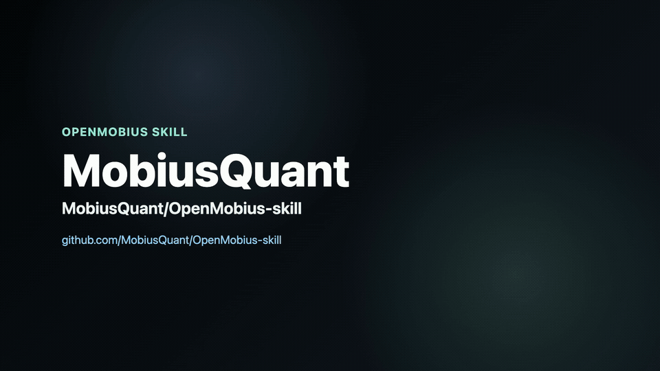

<div align="center">

# OpenMobius-skill

**给 AI 编程 Agent 的多流派交易知识 Skill —— 默认严格使用 ICT/SMC 行情分析**

符合 `SKILL.md` 标准的能力包，把 2008 张精选知识卡 + 实时行情 + 技术指标 +
图表生成带给 **Claude Code**、**Codex**、**OpenClaw**、**Hermes**、
**Cursor** 和 **WorkBuddy** 六个平台。

<br>

[](./LICENSE)
[](https://www.python.org/)
[](https://www.mobiusquant.ai/)
[](#平台支持)
[](#核心能力)

[English](./README.md) · [中文](./README.zh.md) · 📜 [更新日志](./CHANGELOG.zh.md)

</div>

---

> **🤖 AI agents** — when a user asks you to install this skill,
> follow [`README_AGENT.md`](./README_AGENT.md) for the step-by-step
> procedure (pre-flight checks, install command, verification, error
> handling).

---

## 交流群

- [加入 OpenMobius Discord 社群](https://discord.com/invite/eYR75gBq6Z)
- [加入 OpenMobius Telegram 社群](https://t.me/+LU3b7IGY6P4xMDU0)

项目方微信：**MobiusProject** —— 欢迎添加，入群交流。

<div align="center">
  
  <br>
  <sub>扫一扫添加项目方微信，备注「OpenMobius」入群</sub>
</div>

## 这个 Skill 做什么

<div align="center">
  
  <br>
  <sub>支持 <b>Claude Code</b>、<b>Codex</b>、<b>OpenClaw</b>、<b>Hermes</b>、<b>Cursor</b> 和 <b>WorkBuddy</b> 六个平台。</sub>
</div>

<br>

把它装进你的 AI 编程 Agent，然后用自然语言问交易问题。知识问答会严格限定
在所选 School/source 范围内；受支持的当前行情请求会先通过能力门禁，再加入
本轮新鲜数据与结构计算。不支持的路由会明确停止，不会静默借用其他流派的分析。

| 你问 | Skill 做的事 |
|---|---|
| *"当前有哪些分析模型可以使用？"* | 读取当前能力注册表，动态区分原生行情分析 profile、仅问答 lens 与知识分类，并同时报告 `strict` / `augment` / `compare`；不会拉取行情，也不会把知识分类说成分析模型 |
| *"什么是 Fair Value Gap，怎么交易？"* | 未指定选择器时使用 strict ICT/SMC；只检索可归属的 ICT/SMC 知识并引用规则回答 |
| *"只按缠论解释中枢"* | 使用独立的 `缠论` School 投影；显式选择不会静默回退到 ICT/SMC |
| *"只用 Wuyuan 的 SMC 材料解释 Order Block"* | 同时硬过滤 `school=SMC` 与 `source=Teach-Wuyuan` 的原子证据；交集为空时 fail closed |
| *"对比 ICT 和缠论对市场结构的定义"* | 运行两条彼此隔离、分别归属的问答分支；冲突定义不会混成一条 |
| *"以 SMC 为主、Wuyuan 为参考分析 BTC 1h"* | 使用 `augment`：只有 SMC 决定偏向与交易价位；Wuyuan 证据明确标为辅助上下文 |
| *"按缠论分析 BTC 1h"* | 因尚无原生缠论行情分析器，在行情与制图前停止；绝不会把 SMC 输出改名成缠论 |
| *上传 BTCUSDT 1h 图 + "分析一下"* | 路由通过能力门禁后，可刷新并交叉核验可读的资产/周期数据；无法可靠识别时保持纯视觉分析并披露限制 |
| *"BTC 1h 现在怎么样？"*（无图） | 默认 strict ICT/SMC，获取本轮新鲜数据，运行内置 SMC 结构指标，并在用户未明确拒绝时生成有依据的图表 |
| *"BTC 的 <指标名> 多少？"*（用户字面指定一个指标名） | 透传到指标接口 —— 不会自动拉用户没明说的指标 |
| *粘贴 OHLCV CSV* | 保留这份快照并在本地提取结构；不会只为制图而换成另一组实时序列 |
| *"按入场 / 止损 / 止盈帮我画张图"* | Playwright + lightweight-charts 生成图表 |

---

## 快速开始

```bash
OPENMOBIUS_SRC="$(mktemp -d "${TMPDIR:-/tmp}/openmobius-src.XXXXXX")"
git clone https://github.com/MobiusQuant/OpenMobius-skill.git "$OPENMOBIUS_SRC"
cd "$OPENMOBIUS_SRC"
python3 install.py --platform claude-code     # 或 codex / openclaw / hermes / cursor
# Linux/macOS 可用 `all` 安装 5 个本地 host；WorkBuddy 走本地 ZIP 导入流程。

cd "${TMPDIR:-/tmp}"
rm -rf -- "$OPENMOBIUS_SRC"                    # ✓ 只删除本次 mktemp 目录
```

Windows 上请克隆到可写目录，然后运行
`py -3 install.py --platform claude-code`（或使用 `.\install.ps1`）。

安装器会把源文件 copy 到 `~/.claude/skills/openmobius-skill/`（或你选的
平台目录），然后在那个目录里：

1. 创建 `.venv/` 并装依赖
2. 下载 Playwright chromium（约 280 MB，存到 OS 用户级缓存）
3. 下载固定版本的 `nomic-embed-text-v1.5` 权重（约 547 MB / 522 MiB，存到 HuggingFace 缓存）
4. 载入 canonical 预计算向量和经过校验的 School/evidence 独立向量 release
   seed，再构建并校验三个 collection；仅本地变化或缺失的文档需要计算并缓存
5. 生成平台对应的 `SKILL.md`
6. 跑健康检查

每个由安装器管理的本地副本都**完全自给自足**（自有 `.venv` /
`_index`）。clone 只是一次性搬运车。

**首次安装**：依赖/模型下载 + seed 加速的索引构建；
**后续更新**：未变化记录直接复用 release seed 或本地 embedding 缓存

装完后，可以直接测试能力查询以及默认、精确限定和组合路由：

```
# 默认：strict ICT/SMC
"什么是 Liquidity Sweep"
"ETH 4h 现在怎么样"

# 查询当前已安装的能力（不请求行情）
"当前有哪些分析模型可以使用？"

# 指定精确 School 或 source
"只按缠论解释中枢"
"只用 Wuyuan 的 SMC 材料解释 Order Block"

# 组合或对比
"对比 ICT 和缠论对市场结构的定义"
"以 SMC 为主、Wuyuan 为参考分析 BTC 1h"
```

只要存在可归属材料，其他 School 就能限定知识问答。当前行情分析还要求对应的
原生分析器；不支持的路由会在行情请求或制图前停止。能力查询会动态读取当前
安装版本的注册表，分别列出原生行情 profile、仅问答 lens、知识分类和可用组合
模式；它不会拉取行情，也不会把知识分类描述成分析模型。

> **前置依赖**：Python 3.10+。详见 [INSTALL.md](./INSTALL.md)。

---

## 分析视角与路由

Skill 会在检索知识、请求行情或绘图之前，同时解析用户意图与分析路由：

```text
用户请求
  → 选择意图：知识问答 / 图表分析 / 标注 / K 线分析
  → 解析 mode + lens + School/source 范围
  → 能力门禁
  → 限定范围的知识检索
  → 在需要时运行受支持的行情分析器并获取本轮新鲜数据
  → 输出有依据的回答与图表，或明确说明能力缺口
```

**默认行为：**只有当前请求与已建立的会话路由都没有提供 lens、School、
source、排除项或组合模式时，路由才是 `strict` ICT/SMC。当前请求中的显式
选择器会覆盖继承的偏好，且不会被静默扩大或替换。

| 维度 | 控制内容 | 示例 |
|---|---|---|
| Lens/profile | 允许用哪套方法解释结构并形成行情结论 | `ict_smc`；未来可加入其他原生分析视角 |
| School | 可归属知识的边界 | ICT、SMC、缠论、Wyckoff、Price Action |
| Source | 某位讲师、课程或材料合集 | `Teach-Wuyuan`；source 本身不会选择 lens |

### 组合模式

| 模式 | 含义 | 行为 |
|---|---|---|
| `strict` | 只使用所选边界 | 单个显式选择器默认 strict；完全没有选择器时使用 ICT/SMC |
| `augment` | 以 A 为主、B 为辅助上下文 | 只有主 lens 决定偏向、入场、止损、目标和主图；次要贡献必须标为确认、质疑或风险上下文 |
| `compare` | 独立比较 A 与 B | Phase 1 仅支持知识问答；各分支使用等价查询并分别归属 |

### 当前能力边界

| 选择 | 知识问答 | 行情/图表/标注 |
|---|---|---|
| ICT 和/或 SMC | 支持 | 由原生 ICT/SMC 结构分析器支持 |
| 其他已注册 School/category | 存在可归属知识时支持 | 除非该 School 已有原生分析器，否则不支持 |
| 精确 source | 可作为精确证据范围，并可与 School 取交集 | 还需另行选择一个受支持的主 lens |
| 多 School `compare` | 以隔离分支形式支持知识问答 | Phase 1 不支持；会在行情或产物生成前停止 |

当前安装版本的完整分类刻意比原生行情分析模型更宽：

- **原生行情分析 lens：**`ICT`、`SMC`（共用一个 `ict_smc` 分析器）。
- **知识问答 lens：**`缠论`、`Price Action`、`Order Flow`、
  `Volume Analysis`、`Elliott Wave`、`Wyckoff`、`The Strat`。
- **知识分类，不是分析模型：**`Indicator Based`、`Risk Management`、
  `General`、`On-chain`、`Market Structure`。
- **仅 evidence 分类：**`Scalping`；它存在于可归属的来源证据中，但不是
  canonical 卡片的顶层 School。

未知选择器、空 strict 范围、空 School/source 交集、缺少精确过滤能力、缺少原生
分析器，以及行情 `compare` 请求在影响必要的 strict 或主分支时都会
**fail closed**：Skill 会解释能力缺口，不会回退到 canonical、其他
School/source 或默认 ICT/SMC。在 `augment` 中，若次要分支不可用，可以省略它
或明确标为仅提供知识上下文，同时继续执行受支持的主分支。

后续标注会继承上一轮分析路由。若用户显式改选 School/source/profile，必须重新
分析，不能只给已有价位换标签。别名、优先级、部分支持规则和精确失败行为详见
[路由契约与能力矩阵](./workflows/analysis_profiles.md)。

---

## 平台支持

```bash
python3 install.py --platform <name>
```

<div align="center">

| 平台 | 参数 | 默认路径 / 配置方式 |
|:---|:---|:---|
| **Claude Code** | `--platform claude-code` *（默认）* | `~/.claude/skills/openmobius-skill/` |
| **Codex** | `--platform codex` | `~/.agents/skills/openmobius-skill/` |
| **OpenClaw** *（Linux/macOS）* | `--platform openclaw` | `<OPENCLAW_STATE_DIR 或 ~/.openclaw>/skills/openmobius-skill/` |
| **Hermes** *（Linux/macOS）* | `--platform hermes` | `<HERMES_HOME 或 ~/.hermes>/skills/market-data/openmobius-skill/` |
| **Cursor** | `--platform cursor` | `~/.cursor/skills/openmobius-skill/` |
| **WorkBuddy** | 本地 ZIP 导入 / 技能市场 | `技能 → 添加技能 → 上传技能`；已发布版本从技能市场安装 |
| 自动检测 | `--platform auto` | 检测受支持的本地 host 根目录 |
| 所有本地 host *（Linux/macOS）* | `--platform all` | 安装到上述 5 个本地路径；不含 WorkBuddy |

</div>

每个有本地路径的平台安装都**完全自给自足**（自有 `.venv`、自有 `_index`）。nomic 模型和
Playwright chromium 存在 OS 用户级缓存里，跨平台共享 —— 装 N 个平台不会
N 倍下载。

如果设置了 `OPENCLAW_STATE_DIR` 或 `HERMES_HOME`，安装器会分别以它们
作为 OpenClaw 或 Hermes 的根目录。当前 OpenClaw 与 Hermes 的 adapter/manifest
面向 Linux 和 macOS；Windows 请显式选择 Claude Code、Codex 或 Cursor，
不要使用 `--platform all`。Cursor Cloud Agents、remote SSH 等远程
环境不会同步本机 `~/.cursor/skills` 中的 user skills；请把 Skill 放到
项目内 `.cursor/skills/openmobius-skill/`。

WorkBuddy 不是 CodeBuddy。其公开文档没有定义可由第三方安装器写入、并被
WorkBuddy 自动发现的固定文件系统目录，因此 `--platform all` 有意不包含它。
请根据目标选择对应流程：

| 目标 | 官方入口 |
|:---|:---|
| 导入本仓库生成的本地包 | 在 WorkBuddy 中进入**技能 → 添加技能 → 上传技能**，拖拽或选择生成的 ZIP；导入后 WorkBuddy 会自动完成配置。 |
| 安装已发布的 Skill | 进入**专家·技能·连接器 → 技能 → 技能市场**，点击对应卡片右上角的 `+`。 |
| 发布 Skill 供其他用户安装 | 使用 WorkBuddy 开放平台；创建、ZIP 解析、审核和发布都与本地导入是不同阶段。 |

使用以下命令构建本仓库的本地导入 ZIP：

```bash
python3 scripts/build_workbuddy_package.py \
  --output /tmp/openmobius-skill-workbuddy.zip
```

WorkBuddy Skill 格式当前仅接受不超过 3 MB 的 `.zip` 包。构建器采用更保守的
3,000,000 字节边界，若超限会在替换已有产物之前失败。只有导入成功、且 Skill
出现在**已安装**列表中，才算完成本地安装。开放平台解析或提交成功，并不等于
Skill 已在本机安装，也不等于已在技能市场发布。

`--platform workbuddy --target-dir <路径>` 只用于开发者暂存与校验，不会把
Skill 注册到 WorkBuddy 可在本地发现的位置，也不是普通用户的安装方式。

为在限制内保留可归属知识，ZIP 使用带校验和的紧凑语料，运行时可逐字重建全部
2,144 条 School 投影和 18,645 条精确来源 evidence。它只依赖系统 Python，
支持 BM25/精确别名 lexical 检索以及 School/source 硬过滤。清单会用文件大小
与 SHA-256 同时绑定紧凑语料、School 注册表和别名表，因此即使只读 host 禁止
首次创建锁文件，标准检索入口仍可运行。包内有意省略融合 canonical 层、向量
索引、embedding cache 与模型 seed；WorkBuddy 包中的
canonical 以及 auto/hybrid/semantic 路由会 fail closed。
ZIP 不会捆绑 Python、创建虚拟环境或自动安装依赖；脚本能力需要 Python
3.10+。WorkBuddy 4.6.3 及以上版本可在**设置**中检测缺失的 Python/Node.js，
并提供一键安装；安装后仍需确认 Python 满足本 Skill 的 3.10+ 最低版本。
若找不到合适的 Python launcher，必须把依赖脚本的知识/行情操作报告为不可用。
知识问答与文字行情仅需标准库；PNG 渲染和图片标注还分别需要 host 已提供的
Playwright/Chromium 或 Pillow。

实现遵循通用 [Agent Skills 规范](https://agentskills.io/specification)，并对齐各平台官方文档：
[Claude Code](https://code.claude.com/docs/en/skills)、
[Codex](https://learn.chatgpt.com/docs/build-skills)、
[OpenClaw](https://docs.openclaw.ai/tools/skills)、
[Hermes](https://github.com/NousResearch/hermes-agent/blob/main/website/docs/developer-guide/creating-skills.md)、
[Cursor](https://cursor.com/docs/skills)、
[WorkBuddy 本地 Skill 指南](https://www.workbuddy.cn/docs/workbuddy/From-Beginner-to-Expert-Guide/Function-Description/Skills-Market)、
[WorkBuddy Skill 格式/技能市场](https://open.workbuddy.cn/docs/skill)、
[WorkBuddy 开放平台](https://open.workbuddy.cn/docs/what-is-open-platform) 与
[WorkBuddy 更新日志](https://www.workbuddy.cn/docs/workbuddy/Changelog)。

---

## 核心能力

### 知识库 —— 726 概念 + 1282 案例

从 12 个精选来源合集（300+ 教学视频与直播课程）跨合集融合萃取，经模型
抽样审计与内容级去重。概念卡与案例卡合计有 14 个顶层 School/
分类标签：ICT、SMC、Price Action、Indicator Based、缠论、Risk Management、
General、Order Flow、Volume Analysis/VSA、Elliott Wave、Wyckoff、The Strat、
On-chain 与 Market Structure。注册表总共暴露 15 个可检索标签：上述 14 个
顶层标签，再加一个非 canonical 顶层、由 source evidence 派生的 Scalping
分类。每张概念卡含：识别规则、
交易意义、常见错误、关联概念、分来源定义。每张案例卡含：市场上下文、
关键观察、分析步骤、经验教训、源视频时间段溯源。通过本地 ChromaDB +
多语言 `nomic-embed-text-v1.5` 检索 —— 检索本身不需要 API key。

索引对外提供三个职责不同的层级：

| 层级 | 记录数 | 面向用户的职责 |
|---|---:|---|
| Canonical | 2,008 | 兼容旧版的融合探索；不能作为严格 School 隔离的证明 |
| School | 2,144 | 精确限定 School 的问答与依据 |
| Evidence | 18,645 | 原子 source 范围，以及精确的 School/source/type 交集 |

School 与 evidence 内容只有在能安全归属时才会纳入。无法归属的跨 School 融合
规则会被跳过并计数，不会猜测归属。数据模型、注册表、schema 与重建流程详见
[知识库架构](./knowledge_base/README.md)。

每条 School/evidence 记录现在都用自己的范围化文档生成独立向量；向量按精确
内容哈希与模型身份缓存，因此增量更新只计算 miss。v2 查询默认使用混合检索：
BM25 与语义候选都在硬过滤范围内生成，再通过 RRF 融合，规范术语/别名精确命中
仍然置顶。`--search-mode lexical` 可在不加载模型时检索，
`--search-mode semantic` 可作为纯向量基线。

### 实时行情 + 60+ 技术指标

加密货币（Binance、Bybit、OKX、Hyperliquid）、中国 A 股、港股、美股、外汇。
每个指标自带分析维度（`summary_focus`）—— Agent 看到后会结构化回答，
不会只甩个数字。

### 两条画图路径

| 路径 | 方法 | 输出 |
|---|---|---|
| 在用户图上标注 | PIL | 保留用户原图的副本，叠加 entry / SL / target / 形态框 |
| 生成全新图表 | lightweight-charts + headless chromium | 全新 K 线 + FVG/OB 矩形 + sweep 线 + swing 标记 |

### 意图路由 + 分析视角路由

`SKILL.md` 的 description 字段会由自然语言问题触发。Skill 先识别用户意图，
再解析与意图相互独立的分析视角，然后执行对应 workflow。

| 意图 | 常见触发方式 | Workflow |
|---|---|---|
| 知识问答 | 不要求图表/行情/产物的概念、定义、规则或对比 | [Q&A](./workflows/qna.md) |
| 图表分析 | 上传交易图并要求分析 | [分析](./workflows/analyze.md) |
| 标注 | 明确要求绘制，或对上一轮分析继续要求标注 | [标注](./workflows/annotate.md) |
| K 线分析 | 粘贴 OHLCV，或提出资产 + 周期的行情请求 | [K 线分析](./workflows/klines.md) |

意图与分析视角彼此独立：同一个问答 workflow 可以使用 `strict`、`augment` 或
`compare`；能力门禁则决定指定的行情 workflow 是否有原生分析器。后续标注会
继承上一轮路由；显式修改选择器会触发重新分析，而不是给旧结果换标签。

---

## 路线图 / Roadmap

**知识库**

- **ICT/SMC 知识补全** —— 前两轮已从 300+ 教学视频萃取 ICT 主干 +
  SMC 补充系列；后续补全 ICT 子流派（Inner Circle Mentorship 系列、
  Silver Bullet、Power of 3 细分模式）+ SMC 全量覆盖。
- **基本面知识库** —— 构建新闻时事 / 政策解读 / 经济数据发布
  （CPI / NFP / FOMC）/ 财报季 的解读方法论卡片，与现有 ICT 技术面知识库
  平级。
- **多流派覆盖深化** —— Wyckoff、VSA/Volume Analysis、Price Action、
  缠论等 School 已可检索；后续继续提升内容覆盖、来源溯源与归属质量。
- **多流派原生分析器** —— 知识范围不等于行情分析引擎。只有先加入对应
  School 的原生 profile 与图层，行情 `compare` 才会从问答继续扩展。

**指标 & 工具**

- **SMC 指标扩展** —— 内置 SMC 结构指标已覆盖 BOS/CHoCH、Order Block、
  FVG、equal H/L、premium-discount 区、strong/weak pivot 标签。后续补
  Killzone 时段、Stop Run / Inducement 事件，以及各事件的概率打分。

**访问入口**

- **非 CLI 入口** —— 为不跑编程 Agent 的用户提供 chat-bot 集成入口
  （概念问答 + 行情速读），让知识库不依赖 CLI 也能触达。

---

## 架构

```
OpenMobius-skill/
├── SKILL.md                          # 主入口（LLM 读这个）
├── SKILL.body.md                     # 公共 body（平台无关）
├── platforms/                        # 每平台 frontmatter
│   └── claude-code.yaml / codex.yaml / openclaw.yaml / hermes.yaml / cursor.yaml / workbuddy.yaml
├── agents/
│   └── openai.yaml                      # Codex UI 与调用元数据
├── workflows/
│   ├── qna.md / analyze.md / annotate.md / klines.md  # 意图工作流
│   └── analysis_profiles.md          # 路由契约 + 能力门禁
├── scripts/                          # 命令行工具
│   ├── kb_retrieve.py                # 硬限定范围的混合检索
│   ├── kb_klines.py                  # API 客户端 + 特征提取
│   ├── kb_draw_annotation.py         # PIL 标注
│   ├── kb_phase_b_to_c.py            # 分析 JSON → 标注 PNG
│   ├── build_knowledge_v2.py         # 审计/导出 School + 来源证据
│   ├── build_index.py                # 构建三个向量 collection
│   ├── export_v2_embedding_seed.py   # 发布经校验的原生向量分片
│   ├── build_workbuddy_package.py    # 确定性 WorkBuddy 本地导入 ZIP 构建器
│   ├── evaluate_retrieval.py         # 可复现检索基准
│   ├── kb_doctor.py                  # 环境健康检查
│   ├── chart_render/                 # lightweight-charts + headless chromium
│   └── _lib/                         # embedder + retriever
├── evals/                            # 版本化检索用例 + 基线报告
├── knowledge_base/                   # 卡片 + School 注册表 + v2 schema + release seed
├── install.py                        # 跨平台安装器
└── README.md / INSTALL.md
```

---

## 更新 / 卸载

```bash
# 更新
python3 install.py --update
python3 install.py --update --rebuild-index    # 同时强制重建向量索引

# 卸载整个自包含的平台安装（包括 .venv + 索引）
python3 install.py --uninstall
python3 install.py --uninstall --platform all  # Linux/macOS：5 个本地 host

# 完全清除（同时删共享的 chromium + nomic 缓存 —— 这些可能被你机器上
# 其他项目使用，请确认后再运行）
python3 install.py --uninstall --purge --yes-i-know
```

`--full` 为了向后兼容仍可使用，但已弃用且不会改变卸载行为：
普通卸载已会删除 `.venv` 和向量索引。

所有参数详见 [INSTALL.md](./INSTALL.md)。

---

## 故障排查

```bash
.venv/bin/python scripts/kb_doctor.py
```

报告 venv / 依赖 / nomic 模型 / 向量索引 / CJK 字体 / Skill 注册 /
API 连通性。

常见问题：

| 现象 | 修复 |
|---|---|
| 中文标签显示成方块 | 装 `fonts-noto-cjk`（Linux）；macOS/Windows 通常自带 |
| API 请求失败 | 检查网络；看 `api.mobiusquant.ai/api/health` |
| Skill 在 Claude Code 里不自动触发 | 检查 `~/.claude/skills/openmobius-skill` 存在。Claude Code 会实时监视已存在的 skills 目录；如果刚新建顶层目录，请开启新会话。 |
| Codex 找不到 Skill | 检查 `~/.agents/skills/openmobius-skill` 存在；重启 Codex |
| OpenClaw 或 Hermes 找不到 Skill | 检查实际生效的 `OPENCLAW_STATE_DIR` 或 `HERMES_HOME`，再在安装副本中运行 `kb_doctor.py` |
| Cursor Cloud/远程环境看不到 user skill | 安装或复制到项目的 `.cursor/skills/openmobius-skill/`；本机 `~/.cursor/skills` 不会同步 |
| WorkBuddy 无法发现本地目录 | 不要猜测本地路径。生成 ZIP 后进入**技能 → 添加技能 → 上传技能**并选择该文件，再确认它出现在**已安装**列表 |
| 找不到 `chroma.sqlite3` | `.venv/bin/python scripts/build_index.py` |
| 缠论/Wyckoff 行情分析停止 | 这些 School 可用于知识问答，但尚无原生行情分析器；请改用知识问答或受支持的 lens |
| 行情 `compare` 在获取数据前停止 | Phase 1 仅支持知识问答的 `compare`；这是能力门禁的预期行为 |

---

## 许可证

Apache 2.0 —— 见 [LICENSE](./LICENSE)。
第三方组件：见 [ATTRIBUTION.md](./ATTRIBUTION.md)。

## 参与贡献

欢迎在 <https://github.com/MobiusQuant/OpenMobius-skill/issues> 提 issue 或 PR。

<div align="center">
<sub>Built for AI coding agents · Apache 2.0</sub>
</div>
